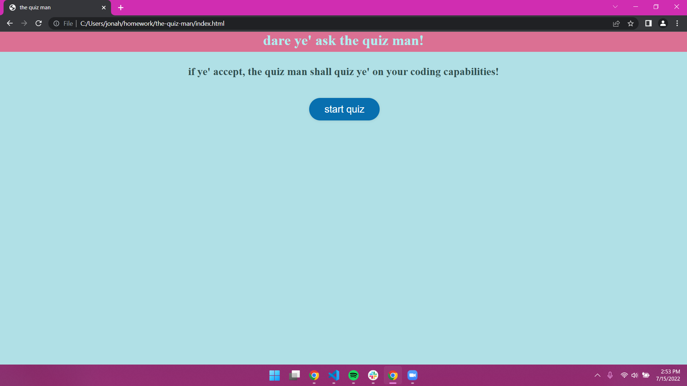

this is my coding quiz, its admittedly short and basic but it functions without errors and has a working highscores section.
i wrote the whole thing to insert each round of questions one at a time from the JS which made the JS file huge and the html file very small,
while i learned a ton about inserting html, the benefits and pitfalls of it, and the way scope affects functions and methods i wouldnt do it this way again because it produced an extraordinary amount of bugs and frustration.

[link for the deployed website](https://jonahlindsley.github.io/quiz-game/?'link for the deployed website')
